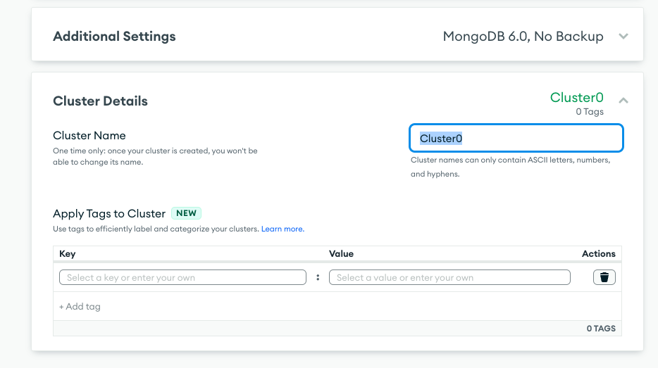

# PeerPrep Backend

> Before proceeding to each microservice for more instructions:

1. Set up cloud MongoDB if you are not using Docker. We recommend this if you are just testing out each microservice separately to avoid needing to manually set up multiple instances of local MongoDB. Otherwise, if you are using `docker-compose.yml` to run PeerPrep, check out the READMEs in the different backend microservices to set up the `.env` files for the local MongoDB instances.

2. Set up Firebase.

3. For the microservices that use Redis, to view the contents stored:

   1. Go to [http://localhost:5540](http://localhost:5540).

   2. Click on "Add Redis Database".

   3. Enter `host.docker.internal` as the Host.

   4. Enter the port used by the respective service:
      - User Service: `6379`
      - Collab Service: `6380`

4. Follow the instructions [here](https://nodejs.org/en/download/package-manager) to set up Node v20.

## Setting-up cloud MongoDB (in production)

> This guide references the [user-service README in the PeerPrep-UserService repository](https://github.com/CS3219-AY2425S1/PeerPrep-UserService/blob/main/user-service/README.md)

1. Visit the MongoDB Atlas Site [https://www.mongodb.com/atlas](https://www.mongodb.com/atlas) and click on "Try Free".

2. Sign Up/Sign In with your preferred method.

3. You will be greeted with welcome screens. Feel free to skip them till you reach the Dashboard page.

4. Create a Database Deployment by clicking on the green `+ Create` Button:


5. Make selections as followings:

- Select Shared Cluster
- Select `aws` as Provider


- Select `Singapore` for Region


- Select `M0 Sandbox` Cluster (Free Forever - No Card Required)

> Ensure to select M0 Sandbox, else you may be prompted to enter card details and may be charged!


- Leave `Additional Settings` as it is

- Provide a suitable name to the Cluster




7. Next, click on `Add my Current IP Address`. This will whitelist your IP address and allow you to connect to the MongoDB Database.


8. Click `Finish and Close` and the MongoDB Instance should be up and running.

9. [Optional] Whitelisting All IP's

   1. Select `Network Access` from the left side pane on Dashboard.

      

   2. Click on the `Add IP Address` Button

      

   3. Select the `ALLOW ACCESS FROM ANYWHERE` Button and Click `Confirm`

      

   4. Now, any IP Address can access this Database.

10. After setting up, go to the Database Deployment Page. You would see a list of the Databases you have set up. Select `Connect` on the cluster you just created earlier.

    

11. Select the `Drivers` option.

    

12. Select `Node.js` in the `Driver` pull-down menu, and copy the connection string.

    Notice, you may see `<password>` in this connection string. We will be replacing this with the admin account password that we created earlier on when setting up the Shared Cluster.

    

13. Your cloud Mongo URI will be the string you copied earlier. Take note of it as we will be using in the `.env` files in the various microservices later on.

## Setting-up Firebase

> For ease of testing, you can set up just one firebase to use across all the microservices that need it.

1. Go to https://console.firebase.google.com/u/0/.

2. Create a project and choose a project name. Navigate to `Storage` and click on it to activate it.

3. Select `Start in production mode` and your preferred cloud storage region.

4. After Storage is created, go to `Rules` section and set rule to:

   ```
   rules_version = '2';
   service firebase.storage {
     match /b/{bucket}/o {
       match /{allPaths=**} {
         allow read: if true;
         allow write: if request.auth != null;
       }
     }
   }
   ```

   This rule ensures that only verified users can upload images while ensuring that URLs of images are public. Remember to click `Publish` to save changes.

5. Go to `Settings`, `Project settings`, `Service accounts` and click `Generate new private key`. This will download a `.json` file, which will contain your credentials.

6. You will need to update the following variables in the `.env` files of the various microservices later on.
   - `FIREBASE_PROJECT_ID` is the value of `project_id` found in the downloaded json file.
   - `FIREBASE_PRIVATE_KEY` is the value of `private_key` found in the downloaded json file.
   - `FIREBASE_CLIENT_EMAIL` is the value of `client_email` found in the downloaded json file.
   - `FIREBASE_STORAGE_BUCKET` is the folder path of the Storage. It should look something like `gs://<appname>.appspot.com`.
