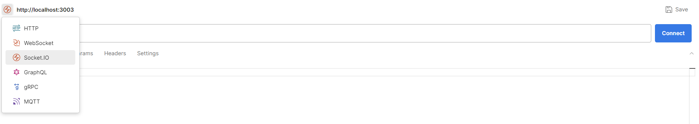
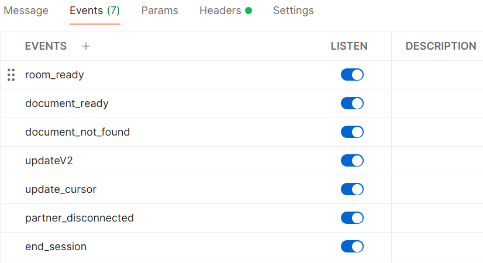
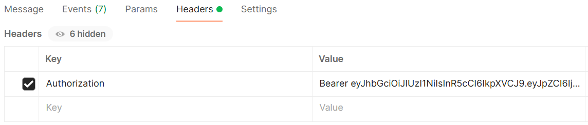
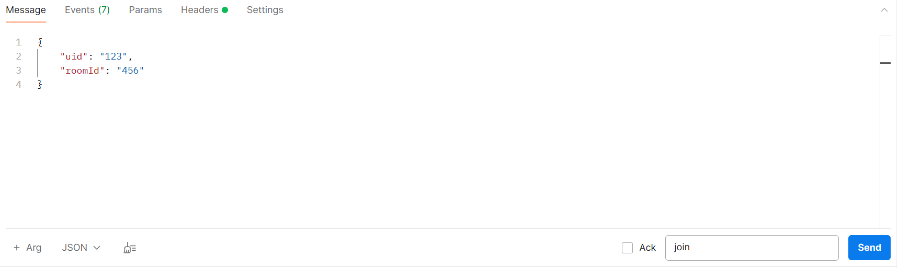

# Collab Service Guide

## Setting-up Collab Service

1. In the `collab-service` directory, create a copy of the `.env.sample` file and name it `.env`.

2. Update the following variable in the `.env` file:

   - `REDIS_URI`

## Running Collab Service Locally

1. Set up and run Redis using `docker compose run --rm --name collab-service-redis -p 6380:6379 collab-service-redis`.

2. Comment out `REDIS_URI` in the `.env` file.

3. Open Command Line/Terminal and navigate into the `collab-service` directory.

4. Run the command `npm install`. This will install all the necessary dependencies.

5. Run the command `npm start` to start the Collab Service in production mode, or use `npm run dev` for development mode, which includes features like automatic server restart when you make code changes.

## Running Collab Service with Docker

1. Open the Command Line/Terminal.

2. Run the command `docker compose run collab-service` to start up the Collab Service and its dependencies.

## After running

1. Using applications like Postman, you can interact with the Collab Service on port 3003. If you wish to change this, please update the `.env` file.

2. Setting up Socket.IO connection on Postman:

   - You should open 2 tabs on Postman to simulate 2 users in the Collab Service.

   - Select the `Socket.IO` option and set URL to `http://localhost:3003`. Click `Connect`.

     

   - Add the following events in the `Events` tab and listen to them.

     

   - In the `Headers` tab, add a valid JWT token in the `Authorization` header.

     

   - In the `Message` tab, select `JSON` in the bottom left dropdown to ensure that your message is being parsed correctly. In the `Event name` input field, enter the name of the event you would like to send a message to. Click on `Send` to send a message.

     

## Events Available

| Event Name                | Description                                      | Parameters                                                                                                                                                                                                                                                                                                                                                                                                  | Response Event                                                                                                                                                                    |
| ------------------------- | ------------------------------------------------ | ----------------------------------------------------------------------------------------------------------------------------------------------------------------------------------------------------------------------------------------------------------------------------------------------------------------------------------------------------------------------------------------------------------- | --------------------------------------------------------------------------------------------------------------------------------------------------------------------------------- |
| **join**                  | Joins a collaboration room                       | `uid` (string): ID of the user. <br><br> `roomId` (string): ID of the room.                                                                                                                                                                                                                                                                                                                                 | **room_ready:** Notify both users in the room that the room is ready (when exactly 2 users have joined).                                                                          |
| **init_document**         | Initializes the server document for the room     | `roomId` (string): ID of the room. <br><br> `template` (string): Document template. <br><br> `uid1` (string): ID of the first user in the room. <br><br> `uid2` (string): ID of the second user in the room. <br><br> `language` (string): Programming language selected by both users. <br><br> `qnId` (string): ID of the selected question. <br><br> `qnTitle` (string): Title of the selected question. | **document_ready:** Notify both users in the room that the server document is ready.                                                                                              |
| **update_request**        | Sends a document update                          | `roomId` (string): ID of the room. <br><br> `update` (`Uint8Array`): Document update.                                                                                                                                                                                                                                                                                                                       | **updateV2:** Sends the updated server document to both users in the room. <br><br> **document_not_found:** Notify both users in the room that the server document was not found. |
| **update_cursor_request** | Sends a cursor update                            | `roomId` (string): ID of the room. <br><br> `cursor` (`Cursor`): Cursor details.                                                                                                                                                                                                                                                                                                                            | **update_cursor:** Notify the partner user of the cursor update.                                                                                                                  |
| **leave**                 | Leaves the collaboration room                    | `uid` (string): ID of the user. <br><br> `roomId` (string): ID of the room. <br><br> `isPartnerNotified` (boolean): Whether the partner user has been notified that this user has left the room.                                                                                                                                                                                                            | **partner_disconnected:** Notify the partner user that this user has disconnected from the collaboration session.                                                                 |
| **end_session_request**   | Sends a request to end the collaboration session | `roomId` (string): ID of the room. <br><br> `sessionDuration` (number): Duration of the collaboration session.                                                                                                                                                                                                                                                                                              | **end_session:** Notify both users in the room that the collaboration session has ended.                                                                                          |
| **reconnect_request**     | Reconnects to the collaboration session          | `roomId` (string): ID of the room.                                                                                                                                                                                                                                                                                                                                                                          | None                                                                                                                                                                              |

### Event Parameter Types

```typescript
interface Cursor {
  uid: string;
  username: string;
  from: number;
  to: number;
}
```
