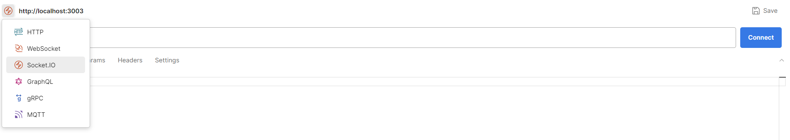
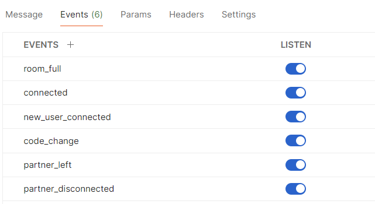
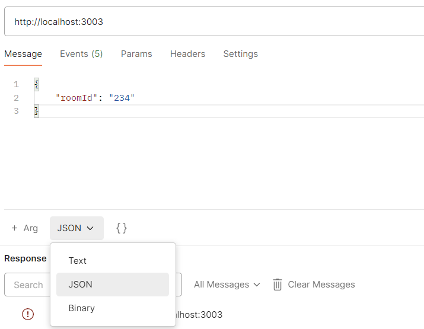
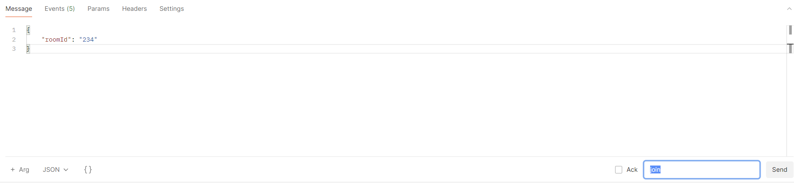

# Collab Service Guide

## Setting-up Collab Service

1. In the `collab-service` directory, create a copy of the `.env.sample` file and name it `.env`.

2. Update the following variable in the `.env` file:

   - `REDIS_URI`

## Running Collab Service Individually

1. Set up and run Redis using `docker compose run --rm --name redis -p 6379:6379 redis`.

2. Open Command Line/Terminal and navigate into the `collab-service` directory.

3. Run the command: `npm install`. This will install all the necessary dependencies.

4. Run the command `npm start` to start the Collab Service in production mode, or use `npm run dev` for development mode, which includes features like automatic server restart when you make code changes.

## Running Collab Service Individually with Docker

1. Open the command line/terminal.

2. Run the command `docker compose run collab-service` to start up the collab service and its dependencies.

## After running

1. Using applications like Postman, you can interact with the Collab Service on port 3003. If you wish to change this, please update the `.env` file.

2. Setting up Socket.IO connection on Postman:
   - You should open 2 tabs on Postman to simulate 2 users in the Collab Service.

   - Select the `Socket.IO` option and set URL to `http://localhost:3003`. Click `Connect`.
   
   
   - Add the follow events in the `Events` tab and listen to them.
   
   
   - To send a message, go to the `Message` tab and ensure that your message is being parsed as `JSON`.
   
   
   - In the `Event name` input, input the correct event name. Click on `Send` to send a message.
   

## Events Available   
| Event Name     | Description                       | Parameters                                                                    | Response Event                                                                                                            |
|----------------|-----------------------------------|-------------------------------------------------------------------------------|---------------------------------------------------------------------------------------------------------------------------|
| **join**       | Joins a collaboration room.       | `roomId` (string): ID of the room.                                            | **room_full:** Emitted if the room is full (only 2 users allowed). **connected:** Emitted upon successful connection. |
| **change**     | Sends updated code to other user. | `roomId` (string): ID of the room. `code` (string): Updated code content. | **code_change:** Emitted with the updated code content.                                                                   |
| **leave**      | Leaves the collaboration room.    | `roomId` (string): ID of the room.                                            | **left:** Emitted when one user leaves the room, notifying the other user.                                                |
| **disconnect** | Disconnects from the server.      | None                                                                          | **disconnected:** Emitted when one user is disconnected, notifying the other user.                                        |