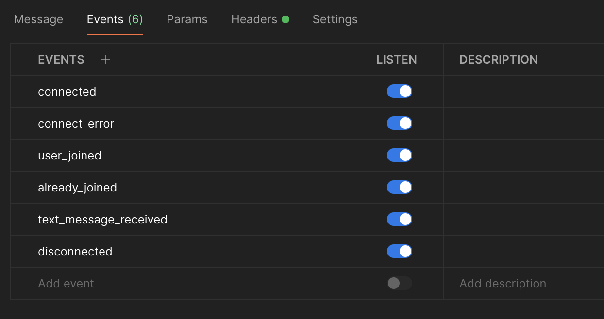

# Communication Service Guide

> Please ensure that you have completed the backend set-up [here](../README.md) before proceeding.

## Setting-up Communication Service

1. In the `communication-service` directory, create a copy of the `.env.sample` file and name it `.env`.

## Running Communication Service Individually

1. Open Command Line/Terminal and navigate into the `communication-service` directory.

2. Run the command: `npm install`. This will install all the necessary dependencies.

3. Run the command `npm start` to start the Communication Service in production mode, or use `npm run dev` for development mode, which includes features like automatic server restart when you make code changes.

## Running Communication Service Individually with Docker

1. Open the command line/terminal.

2. Run the command `docker compose run -p 3005:3005 communication-service` to start up the communication service and its dependencies.

## After Running

1. Using applications like Postman, you can interact with the Communication Service on port 3005. If you wish to change this, please update the `.env` file.

2. Setting up Socket.IO connection on Postman:

   - You should open 2 tabs on Postman to simulate 2 users in the Communication Service.

   - Select the `Socket.IO` option and set URL to `http://localhost:3005`. Click `Connect`.

   

   - Add the following events in the `Events` tab and listen to them.

   

   - Add a valid JWT token in the `Authorization` header.

   

   - In the `Event name` input, input the correct event name. Click on `Send` to send a message.

   

   - To send a message, go to the `Message` tab and ensure that your message is being parsed as `JSON`.

   

## Events Available

| Event Name            | Description                       | Parameters                                                                                                                                                                                           | Response Event                                                                        |
| --------------------- | --------------------------------- | ---------------------------------------------------------------------------------------------------------------------------------------------------------------------------------------------------- | ------------------------------------------------------------------------------------- |
| **join**              | Joins a communication rooms       | `roomId` (string): ID of the room.   `username` (string): Username of the user that joined.                                                                                                       | **user_joined**: Notify the other user that a new user has joined the room.           |
| **send_text_message** | Sends a message to the other user | `roomId` (string): ID of the room.   `message` (string): Message to send.   `username` (string): User that sent the message.   `createdTime` (number): Time that the user sent the message. | **text_message_received**: Notify the user that a message is sent                     |
| **user_disconnect**   | User disconnection.               | None                                                                                                                                                                                                 | **user_left**: To notify the user when one user leaves.                               |
| **disconnect**        | Disconnects from the server.      | None                                                                                                                                                                                                 | **disconnected**: To notify the user when one user gets disconnected from the server. |
