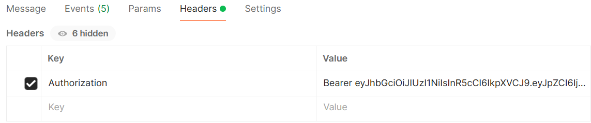

# Matching Service Guide

> Please ensure that you have completed the backend set-up [here](../README.md) before proceeding.

## Setting-up Matching Service

1. In the `matching-service` directory, create a copy of the `.env.sample` file and name it `.env`.

2. You can access RabbitMq management user interface locally with `RABBITMQ_DEFAULT_USER` as the username and `RABBITMQ_DEFAULT_PASS` as the password at http://localhost:15672. You may update `RABBITMQ_DEFAULT_USER` and `RABBITMQ_DEFAULT_PASS` in the `.env` file to change your RabbitMq credentials if necessary.

## Running Matching Service Locally

1. Set up and run RabbitMq using `docker run -it --rm --name rabbitmq -p 5672:5672 -p 15672:15672 rabbitmq:4.0-management`.

2. Comment out `RABBITMQ_ADDR` in the `.env` file. You can access RabbitMq management user interface locally with the username `guest` and password `guest` at http://localhost:15672.

3. Open Command Line/Terminal and navigate into the `matching-service` directory.

4. Run the command: `npm install`. This will install all the necessary dependencies.

5. Run the command `npm start` to start the Matching Service in production mode, or use `npm run dev` for development mode, which includes features like automatic server restart when you make code changes. If you encounter connection errors, please wait for a few minutes before running `npm start` again as RabbitMq may take some time to start up.

## Running Matching Service with Docker

1. Open the Command Line/Terminal.

2. Run the command `docker compose run matching-service` to start up the Matching Service and its dependencies.

## After running

1. Using applications like Postman, you can interact with the Matching Service on port 3002. If you wish to change this, please update the `.env` file.

2. Setting up Socket.IO connection on Postman:

   - You should open 2 tabs on Postman to simulate 2 users in the Matching Service.

   - Select the `Socket.IO` option and set URL to `http://localhost:3002`. Click `Connect`.

   

   - Add the following events in the `Events` tab and listen to them.

   

   - In the `Headers` tab, add a valid JWT token in the `Authorization` header.

   

   - In the `Message` tab, select `JSON` in the bottom left dropdown to ensure that your message is being parsed correctly. In the `Event name` input field, enter the name of the event you would like to send a message to. Click on `Send` to send a message.

   

## Events Available

| Event Name                | Description                                                             | Parameters                                                                                                                                                                                                                                                                    | Response Event                                                                                                                                                                             |
| ------------------------- | ----------------------------------------------------------------------- | ----------------------------------------------------------------------------------------------------------------------------------------------------------------------------------------------------------------------------------------------------------------------------- | ------------------------------------------------------------------------------------------------------------------------------------------------------------------------------------------ |
| **user_connected**        | User joins the matching process                                         | `uid` (string): ID of the user.                                                                                                                                                                                                                                               | None                                                                                                                                                                                       |
| **user_disconnected**     | User leaves the matching process                                        | `uid` (string): ID of the user.                                                                                                                                                                                                                                               | **match_unsuccessful**: If the user left during the match offer phase, notify the partner user that the match was unsuccessful                                                             |
| **match_request**         | Sends a match request                                                   | `matchRequest` (`MatchRequest`): Match request details. <br><br> `callback` (`(requested: boolean) => void`): To check if the match request was successfully sent.                                                                                                            | **match_request_exists**: Notify the user that only one match request can be processed at a time. <br><br> **match_request_error**: Notify the user that the match request failed to send. |
| **match_cancel_request**  | Cancels the match request                                               | `uid` (string): ID of the user.                                                                                                                                                                                                                                               | None                                                                                                                                                                                       |
| **match_accept_request**  | Accepts the match request                                               | `uid` (string): ID of the user.                                                                                                                                                                                                                                               | **match_successful**: If both users have accepted the match offer, notify them that the match is successful.                                                                               |
| **match_decline_request** | Declines the match request                                              | `uid` (string): ID of the user. <br><br> `matchId` (string): ID of the user. <br><br> `isTimeout` (boolean): Whether the match was declined due to match offer timeout.                                                                                                       | **match_unsuccessful**: If the match was not declined due to match offer timeout (was explicitly rejected by the user), notify the partner user that the match is unsuccessful.            |
| **rematch_request**       | Sends a rematch request                                                 | `matchId` (string): ID of the match. <br><br> `partnerId` (string): ID of the partner user. <br><br> `rematchRequest` (`MatchRequest`): Rematch request details. <br><br> `callback` (`(requested: boolean) => void`): To check if the rematch request was successfully sent. | **match_request_error**: Notify the user that the rematch request failed to send.                                                                                                          |
| **match_end_request**     | User leaves the matching process upon leaving the collaboration session | `uid` (string): ID of the user. <br><br> `matchId` (string): ID of the match.                                                                                                                                                                                                 | None                                                                                                                                                                                       |

### Event Parameter Types

```typescript
interface MatchUser {
  id: string;
  username: string;
  profile?: string;
}

interface MatchRequest {
  user: MatchUser;
  complexity: string;
  category: string;
  language: string;
  timeout: number;
}
```
