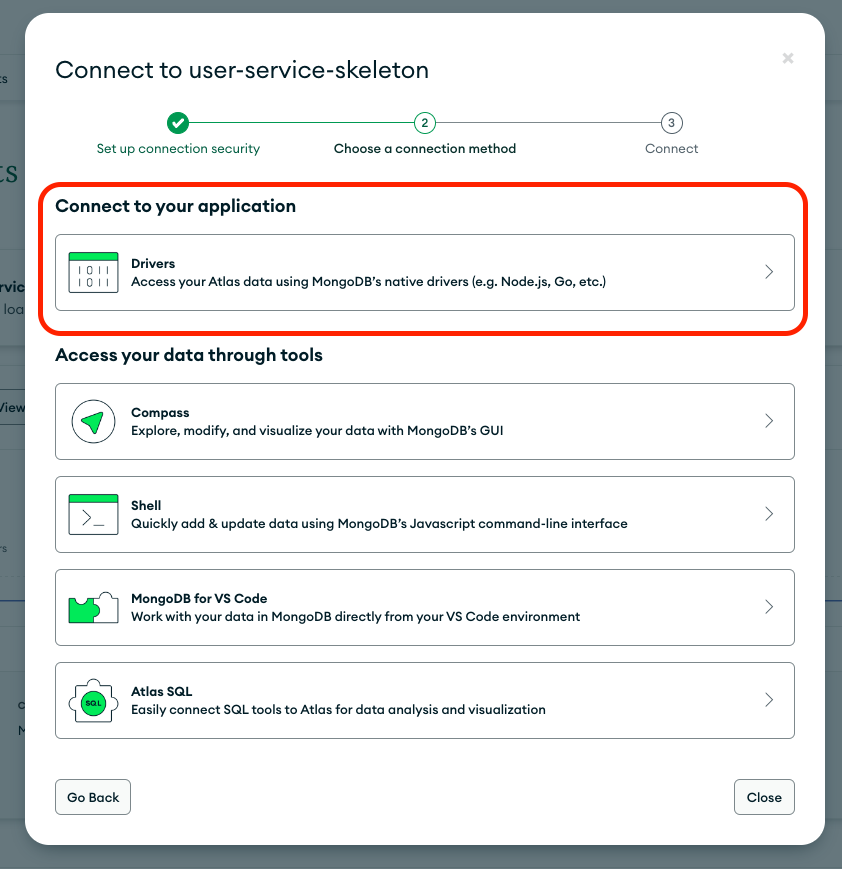

# User Service Guide

## Setting-up MongoDB

> :notebook: If you are familiar to MongoDB and wish to use a local instance, please feel free to do so. This guide utilizes MongoDB Cloud Services.

1. Set up a MongoDB Shared Cluster by following the steps in this [Guide](MongoDBSetup.md).

2. After setting up, go to the Database Deployment Page. You would see a list of the Databases you have set up. Select `Connect` on the cluster you just created earlier.

   

3. Select the `Drivers` option, as we have to link to a Node.js App (User Service).

   

4. Select `Node.js` in the `Driver` pull-down menu, and copy the connection string.

   Notice, you may see `<password>` in this connection string. We will be replacing this with the admin account password that we created earlier on when setting up the Shared Cluster.

   

5. In the `user-service` directory, create a copy of the `.env.sample` file and name it `.env`.

6. Update the `DB_CLOUD_URI` of the `.env` file, and paste the string we copied earlier in step 4.

## Running User Service

1. Follow the instructions [here](https://nodejs.org/en/download/package-manager) to set up Node v20.

2. Open Command Line/Terminal and navigate into the `user-service` directory.

3. Run the command: `npm install`. This will install all the necessary dependencies.

4. If you are running the user service for the first time with your own database, run `npm run seed`, to seed the database with a default admin account. If you wish to change the default, please update the `.env` file. Alternatively, you can also edit your credentials and user profile after you have created the default account. If you are using the .env file provided by us, the default admin account already exists in the database and you can skip this step.

5. Run the command `npm start` to start the User Service in production mode, or use `npm run dev` for development mode, which includes features like automatic server restart when you make code changes.

6. To view User Service documentation, go to http://localhost:3001/docs.

7. Using applications like Postman, you can interact with the User Service on port 3001. If you wish to change this, please update the `.env` file.
